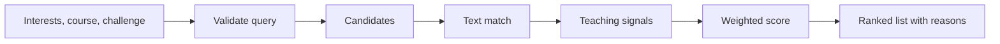
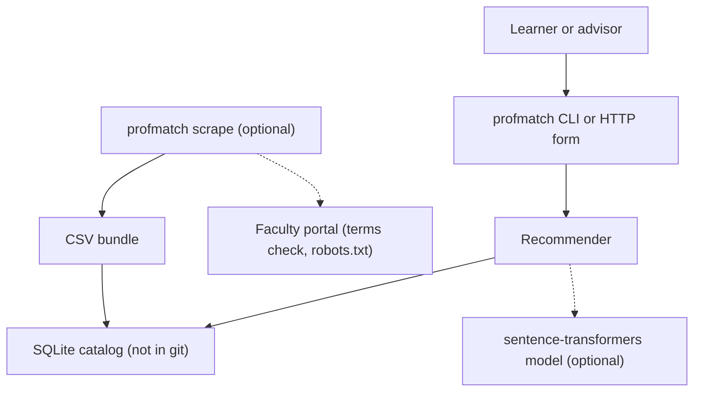
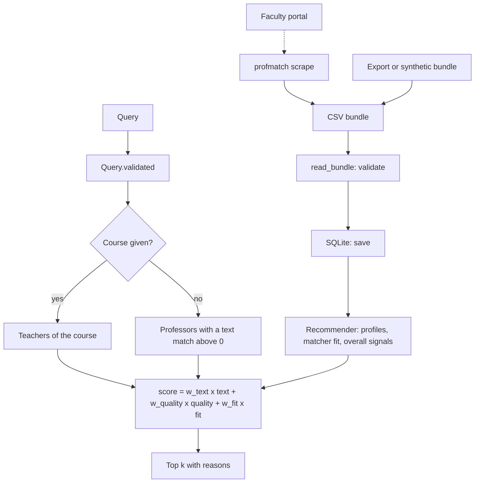

<div align="center">

# profmatch — Explainable Professor Recommendations from Research Profiles and Teaching Signals

**profmatch is a recommender for learners who select a professor. It takes interests, an optional course code and a challenge preference through these steps to a ranked, explained list:**

`validate query` → `candidates` → `text match` → `smoothed teaching signals` → `weighted score` → `reasons`.


**[Summary](#1-summary)** ·
**[Workflow](#4-the-end-to-end-workflow)** ·
**[Run it](#10-how-to-run-profmatch)** ·
**[Configuration](#104-environment-variables)** ·
**[Known problems](#13-known-problems)** ·
**[Glossary](#15-glossary)**

</div>

> [!NOTE]
> This README uses ASD-STE100 Simplified Technical English. The writing rules and the project
> vocabulary are in [`docs/ste-style-guide.md`](docs/ste-style-guide.md). Each term in the
> [Glossary](#15-glossary) has only one meaning.

---

profmatch scores each candidate professor against the query itself. The score adds a text match between the query and one research profile for each professor, a smoothed teaching rating and a challenge fit.
Each result has reasons: the matched terms, the response count and the challenge level.
A labelled query set measures nDCG@5, MRR, recall@5 and coverage against five other rankers.
The offline demo and all tests use a synthetic catalog. They need no portal, no key and no network.

This README is the **one location that explains all of profmatch**. It gives these topics:

- the general design
- each component and its procedure, step by step
- the decision rules
- the data map
- the runbook
- the validation results and the known problems

| If you are… | Read |
|---|---|
| A manager or reviewer | [1](#1-summary), [3](#3-design-rules), [4](#4-the-end-to-end-workflow), [12](#12-validation-results), [14](#14-key-points) |
| A developer who joins the project | All sections, in sequence. Keep [10](#10-how-to-run-profmatch) and [13](#13-known-problems) open while you work |
| An operator who runs profmatch | [10](#10-how-to-run-profmatch), then the section for the component that you use |

---

## Table of contents

1. 🧭 [Summary](#1-summary)
2. 🏗️ [How profmatch is built](#2-how-profmatch-is-built)
   - 2.1 [Components](#21-components)
   - 2.2 [System context](#22-system-context)
   - 2.3 [Repository layout](#23-repository-layout)
3. 🛡️ [Design rules](#3-design-rules)
4. 🔄 [The end-to-end workflow](#4-the-end-to-end-workflow)
   - 4.1 [Full flow](#41-full-flow)
   - 4.2 [The life cycle of one query](#42-the-life-cycle-of-one-query)
5. 🔵 [Ingestion and the catalog](#5-ingestion-and-the-catalog)
6. 🟢 [Profiles, matchers and teaching signals](#6-profiles-matchers-and-teaching-signals)
7. 🟣 [The scorer and the evaluation](#7-the-scorer-and-the-evaluation)
8. ⚖️ [The decision rules](#8-the-decision-rules)
9. 🗂️ [Data and file map](#9-data-and-file-map)
10. ▶️ [How to run profmatch](#10-how-to-run-profmatch)
    - 10.1 [Prerequisites](#101-prerequisites) · 10.2 [Installation](#102-installation) · 10.3 [Run profmatch](#103-run-profmatch) · 10.4 [Environment variables](#104-environment-variables)
11. 🧩 [How to extend profmatch](#11-how-to-extend-profmatch)
12. ✅ [Validation results](#12-validation-results)
13. ⚠️ [Known problems](#13-known-problems)
14. 📌 [Key points](#14-key-points)
15. 📖 [Glossary](#15-glossary)
16. 📄 [License](#16-license)

---

## 1. Summary

**The problem.** A learner wants a professor whose research matches the learner's interests, who teaches a given course, and whose courses have the preferred challenge. These questions are difficult:

- How do you compare free-text interests with publications, keywords and course titles?
- How do you trust a rating that comes from 2 responses?
- How do you rank when only 1 or 2 professors taught the course?
- How do you know that the ranking is good?
- How do you handle personal data from a faculty portal?

profmatch gives each of these questions its own component. Each component has a validated input and a tested output.

| Item | Value |
|---|---|
| Input | Interests (free text), a course code (optional), a challenge preference `lower`, `balanced` or `higher` (optional), `k` |
| Output | Up to `k` professors with a score, a text match, a quality value, a challenge fit, matched terms, courses, signals and reasons |
| Components | **11** modules: textproc, schema, store, signals, profiles, encoders, recommend, evaluate, synthetic, ingest, config (plus `api` and `cli`) |
| Matchers | `tfidf` (default), `bm25`, `sbert:<model>` (optional) |
| Offline mode | The synthetic catalog, the TF-IDF and BM25 matchers, SQLite and the CLI. No key and no network |
| Safety | Exact course codes, no raw scores in the default output, a terms check before a scrape, no CORS by default |
| Tests | **50** unit tests (`pytest`): 49 pass and 1 skips in CI (the API test needs the extra `api`) |



---

## 2. How profmatch is built

### 2.1 Components

| Component | Module | Purpose |
|---|---|---|
| Text processing | `src/profmatch/textproc.py` | Tokens, built-in stop words, exact course-code parser |
| Catalog schema | `src/profmatch/schema.py` | Five record types, CSV bundle reader with validation, bundle writer |
| Storage | `src/profmatch/store.py` | SQLite tables with checks, save and load |
| Teaching signals | `src/profmatch/signals.py` | Bayesian shrinkage, response rate, tertile bands |
| Profiles | `src/profmatch/profiles.py` | One text profile for each professor, without the name |
| Matchers | `src/profmatch/encoders.py` | `TfidfMatcher`, `Bm25Matcher`, `SentenceMatcher` |
| Scorer | `src/profmatch/recommend.py` | `Query`, `Weights`, `Recommender`, reasons |
| Evaluation | `src/profmatch/evaluate.py` | nDCG@5, MRR, recall@5, coverage, 6 rankers, weight tuning |
| Synthetic data | `src/profmatch/synthetic.py` | Synthetic catalog with latent truth, labelled queries |
| Ingestion | `src/profmatch/ingest/` | HTML tree, header-based table reader, fetchers, portal parser |
| Settings | `src/profmatch/config.py` | Environment variables and value checks |
| HTTP API | `src/profmatch/api.py` | FastAPI app with a form (extra `api`) |
| CLI | `src/profmatch/cli.py` | The `profmatch` command with 8 subcommands |

### 2.2 System context



### 2.3 Repository layout

```
profmatch/
├── .github/workflows/ci.yml     # CI: Python 3.11, pip install -e ".[dev]", pytest -q
├── .env.example                 # 9 environment variable names, no values
├── pyproject.toml               # package, extras scrape, api, embed, dev, the profmatch script
├── data/README.md               # sources, terms, bundle columns, query format
├── docs/ste-style-guide.md      # writing rules and project vocabulary
├── examples/portal.example.toml # page rules for the scraper
├── src/profmatch/
│   ├── textproc.py  schema.py  store.py          # input, validation, storage
│   ├── signals.py  profiles.py  encoders.py      # features
│   ├── recommend.py  evaluate.py  synthetic.py   # scorer, evaluation, synthetic data
│   ├── ingest/                                   # html.py, fetch.py, portal.py
│   ├── config.py  api.py  cli.py                 # settings, HTTP API, command line
└── tests/                                        # 50 tests and saved HTML fixtures, no network
```

---

## 3. Design rules

### 3.1 The query decides the ranking
`Recommender` scores each candidate against the query. No step uses the neighbours of a candidate row. A test shuffles all catalog tables and gets the same ranking.

### 3.2 One profile for each professor
`build_profiles` makes one text for each professor from course titles, publications and keywords. Each course title counts once, also for many terms. The name is not part of the profile.

### 3.3 A small sample stays near the mean
`compute_signals` smooths each rating toward the response-weighted mean with a prior of 20 responses. The output always gives the response count. A professor with fewer than 10 responses gets a reason that tells this.

### 3.4 No score is invented
The schema accepts an empty rating or challenge. No step fills it with the professor's own mean or with zero. An offering with 0 responses must have no score.

### 3.5 Course codes are exact
`parse_course_code` accepts only the form `ABCD 1234` and returns one canonical form. The filter compares strings. No input becomes a regular expression.

### 3.6 Personal data is protected
The default output shows quality bands and counts, not raw ratings. The scraper does not start without `PROFMATCH_PORTAL_TERMS_ACCEPTED=yes`, and it obeys `robots.txt`. Git ignores all catalog files.

### 3.7 The HTTP service is closed by default
The API runs without debug mode. CORS is off until `PROFMATCH_CORS_ORIGINS` lists exact origins, and `*` is refused. No download runs at import time.

---

## 4. The end-to-end workflow

### 4.1 Full flow



### 4.2 The life cycle of one query

1. The learner gives interests, a course code, a challenge preference and `k`.
2. `Query.validated` parses the course code, checks the preference and checks that the query has content.
3. If the query has a course, the candidates are the professors who taught it. An unknown course stops the query.
4. If the query has no course, the candidates are the professors with a text match above 0.
5. The matcher gives a text match for each candidate.
6. `compute_signals` gives the smoothed rating and challenge, for the course if the query has one.
7. The scorer adds the three weighted terms and sorts by score, then by `professor_id`.
8. The result gives the top `k`, the reasons and a note when the course has fewer than `k` teachers.

---

## 5. Ingestion and the catalog

**Purpose.** Change portal pages or files into one validated catalog in SQLite.

| Input | Output |
|---|---|
| Portal pages (with `portal.toml`), or a CSV bundle | A CSV bundle, then `profmatch.db` |

**Procedure**

1. `profmatch scrape` reads the directory pages and collects each profile link once.
2. `parse_profile` reads the name, the title and the department, then the teaching table by header names.
3. The parser reads publications and keywords from the list or paragraph after a matching heading.
4. A bad row (bad code, bad counts) or a missing section gives a warning. The scrape continues.
5. `profmatch load` reads the five CSV files. `read_bundle` collects all problems and raises one `SchemaError`.
6. `save` replaces the database content in one transaction. SQLite `CHECK` rules repeat the range rules.

**Rules**

- The table reader needs the fields `course`, `term`, `enrolled` and `responses`. Each field has a list of header aliases in `portal.toml`.
- `HttpFetcher` waits `--interval` seconds (default 2) between requests and caches each page by URL hash.
- `HttpFetcher` refuses a URL outside the configured portal host.

---

## 6. Profiles, matchers and teaching signals

**Purpose.** Give each professor one text profile and one set of teaching signals.

| Input | Output |
|---|---|
| The catalog | `Profile` for each professor, a fitted matcher, `TeachingSignals` for each professor |

**Procedure**

1. `build_profiles` joins the course titles, the 50 newest publication titles and the keywords. It removes stop words.
2. The matcher is fit once on all profiles. Thus the IDF weights do not change with the candidate set.
3. `TfidfMatcher` uses unigrams and bigrams with sublinear term frequency and gives the cosine similarity.
4. `Bm25Matcher` uses k1 = 1.5 and b = 0.75 and divides each score by the best score of the query.
5. `compute_signals` calculates the response-weighted prior over all offerings.
6. For each professor, it calculates the smoothed rating and the smoothed challenge with the prior strength `m`.
7. The band cuts are the tertiles of the overall smoothed values of all professors with responses.

**The shrinkage formula**

`smoothed = (sum(score_i x n_i) + m x prior) / (sum(n_i) + m)`, where `n_i` is the response count of offering `i`.

| Example | Raw mean | Smoothed (m = 20) |
|---|---|---|
| 2 responses, all 5.0, prior 4.3 | 5.00 | 4.36 |
| 60 responses, mean 4.5, prior 4.3 | 4.50 | 4.45 |

---

## 7. The scorer and the evaluation

**Purpose.** Rank the candidates for one query, and measure the ranking on labelled queries.

| Input | Output |
|---|---|
| `Query`, `Weights` | `Result` with recommendations, candidate count and notes |
| Labelled queries (`queries.jsonl`) | nDCG@5, MRR, recall@5 and coverage for each ranker |

**Procedure**

1. `split_queries` puts the even positions in dev and the odd positions in test.
2. `tune_weights` tries each weight triple on a 0.1 grid with a text weight above 0 and keeps the best dev nDCG@5.
3. `full_report` scores six rankers on the test half with the tuned weights.
4. `ndcg_at_k` compares the ranking with the ideal order of the candidates. A grade of 2 or more counts as relevant for MRR and recall.

**The rankers**

| Ranker | Method |
|---|---|
| `scorer` | The profmatch scorer with the tuned weights |
| `raw_mean` | The same scorer with `m = 0` (no shrinkage) |
| `text_only` | Weights (1, 0, 0) |
| `popularity` | Candidates by total responses |
| `random` | A seeded shuffle of the candidates |
| `legacy_knn` | The old method: one row for each offering, a KNN on all rows, the neighbours of row 0 |

---

## 8. The decision rules

| Rule | Value | Where |
|---|---|---|
| Default weights | text 0.7, quality 0.2, fit 0.1 (`PROFMATCH_WEIGHTS`) | `Weights` |
| Quality | `(smoothed rating - 1) / 4`. No rating: 0.5 | `TeachingSignals.quality_score` |
| Challenge fit | Same level 1.0, next level 0.5, opposite level 0.0, unknown level 0.5, no preference 0.0 | `challenge_fit` |
| Prior strength | 20 responses (`PROFMATCH_PRIOR_STRENGTH`) | `compute_signals` |
| Few responses | Fewer than 10 responses (`PROFMATCH_MIN_RESPONSES`) | `TeachingSignals.sufficient` |
| Bands | Tertiles of the overall smoothed values: `lower` / `balanced` / `higher` and `below average` / `average` / `above average` | `compute_signals` |
| Candidates with a course | All professors who taught the course | `Recommender._score` |
| Candidates without a course | Professors with a text match above 0 | `Recommender._score` |
| Tie order | Higher score first, then `professor_id` | `Recommender._score` |
| `k` | 1 to 50 (CLI), 1 to 20 (API) | `Query.validated`, `api.Body` |
| Relevant grade | 2 or more | `evaluate.RELEVANT_GRADE` |

**Validation of the catalog**

| Field | Rule |
|---|---|
| `course_code` | 2 to 5 letters, 3 to 5 digits, one optional letter |
| `responses`, `enrolled` | Integers, `0 <= responses <= enrolled` |
| `overall_rating` | Empty or 1 to 5 |
| `challenge_index` | Empty or 1 to 7 |
| Scores with 0 responses | Refused |
| `professor_id` in other files | Must exist in `professors.csv` |

---

## 9. Data and file map

| Path | Committed? | Contents |
|---|---|---|
| `data/README.md` | Yes | Sources, terms, bundle columns and the query format |
| `data/*` | No (git ignores it) | Your bundles and query files |
| `examples/portal.example.toml` | Yes | Page rules for the scraper, with a placeholder host |
| `tests/fixtures/*.html` | Yes | Hand-written portal pages with placeholder names |
| `.env.example` | Yes | Variable names, no values |
| `.env` | No (git ignores it) | Local settings |
| `artifacts/profmatch.db` | No (git ignores it) | The SQLite catalog (`PROFMATCH_DB`) |
| `artifacts/portal_cache/` | No (git ignores it) | Cached portal pages (`PROFMATCH_CACHE_DIR`) |
| `artifacts/demo/` | No (git ignores it) | Synthetic bundle, database and `demo_summary.json` |
| `*.db`, `*.sqlite`, `*.xlsx` | No (git ignores them) | Any database or spreadsheet export |

---

## 10. How to run profmatch

### 10.1 Prerequisites

| Need | For |
|---|---|
| Python 3.11+ | All components (CI uses 3.11) |
| `numpy`, `scikit-learn` | Core (installed with the package) |
| Extra `scrape` (`httpx`) | `profmatch scrape` |
| Extra `api` (`fastapi`, `uvicorn`, `httpx`) | `profmatch serve` |
| Extra `embed` (`sentence-transformers`) | `PROFMATCH_MATCHER=sbert` |

### 10.2 Installation

```bash
git clone https://github.com/KrishnaAnnavaram/profmatch.git
cd profmatch
python -m venv .venv
. .venv/bin/activate            # Windows: .venv\Scripts\activate
pip install -e ".[dev]"         # add ,api or ,scrape or ,embed when you need them
cp .env.example .env            # optional: empty values keep the defaults
```

### 10.3 Run profmatch

Offline demo (no network, about 3 seconds):

```bash
profmatch demo --out artifacts/demo
```

Step by step on synthetic data:

```bash
profmatch synth --out artifacts/bundle --professors 60 --queries 80
profmatch load artifacts/bundle
profmatch recommend "search engines and learning to rank" --course "INFR 5105" --challenge higher
profmatch recommend "accessibility and usability studies" -k 3 --json
profmatch profile P004
profmatch eval artifacts/bundle/queries.jsonl --tune
```

With seed 0 the synthetic codes include `INFR 5105` and `NETW 5100`. `profmatch profile <id>` shows the codes of one professor.

Real portal and HTTP API:

```bash
pip install -e ".[scrape,api]"
export PROFMATCH_PORTAL_TERMS_ACCEPTED=yes        # only after you read the portal terms
profmatch scrape --config my_portal.toml --out data/bundle
profmatch load data/bundle
profmatch serve --port 8000                       # http://127.0.0.1:8000
```

### 10.4 Environment variables

| Variable | Used by | Meaning |
|---|---|---|
| `PROFMATCH_DB` | All commands | SQLite path. Default `artifacts/profmatch.db` |
| `PROFMATCH_MATCHER` | Recommender | `tfidf` (default), `bm25` or `sbert[:model]` |
| `PROFMATCH_WEIGHTS` | Scorer | Three numbers `text,quality,fit`. Default `0.7,0.2,0.1` |
| `PROFMATCH_PRIOR_STRENGTH` | Signals | Prior weight in responses. Default `20` |
| `PROFMATCH_MIN_RESPONSES` | Signals | Count below which a reason warns of few responses. Default `10` |
| `PROFMATCH_SIGNAL_DISPLAY` | Output | `band` (default, no raw scores) or `value` |
| `PROFMATCH_CORS_ORIGINS` | API | Comma-separated exact origins. Empty: no CORS |
| `PROFMATCH_PORTAL_TERMS_ACCEPTED` | Scraper | Must be `yes` before a scrape |
| `PROFMATCH_CACHE_DIR` | Scraper | Page cache. Default `artifacts/portal_cache` |

A bad value stops the command with `error:`.
Credentials are only in a local `.env` file. Git ignores this file. Do not print or commit credentials.

---

## 11. How to extend profmatch

| You want to… | Do this | Code change? |
|---|---|---|
| Read a different portal | Copy `examples/portal.example.toml` and change the paths, prefixes and aliases | No |
| Use embeddings | `pip install -e ".[embed]"`, then `PROFMATCH_MATCHER=sbert` | No |
| Change the weights | Run `profmatch eval --tune` on your labelled queries, then set `PROFMATCH_WEIGHTS` | No |
| Add a teaching signal | Add a field to `Offering`, the schema, the SQLite table and `compute_signals` | Yes |
| Add a ranker to the evaluation | Write a function that returns a ranking and the candidates, and add it to `full_report` | Small |
| Use Postgres | Write a `save` and `load` pair for Postgres with the same tables | Small |

Planned milestones (not built):

- **M5:** an advisor-labelled query set with an agreement check between two labellers.
- **M6:** a hybrid of BM25 and embeddings with a tuned mix.
- **M7:** a governance review of the real data before any deployment.

---

## 12. Validation results

| Validation | Result | Command |
|---|---|---|
| Unit tests (local, with the extra `api`) | **50 passed** | `pytest -q` |
| Unit tests (CI simulation, clean venv, `.[dev]` only) | **49 passed, 1 skipped** | `pip install -e ".[dev]"`, `pytest -q` |
| Weight tuning on 40 dev queries | Weights text 0.4, quality 0.4, fit 0.2. Dev nDCG@5 0.900 | `profmatch demo` |
| `scorer` on 40 test queries | nDCG@5 **0.817**, MRR 0.988, recall@5 0.642, coverage 1.000 | `profmatch demo` |
| `raw_mean` (no shrinkage) | nDCG@5 0.780, MRR 0.971, recall@5 0.630, coverage 0.917 | `profmatch demo` |
| `text_only` | nDCG@5 0.735, MRR 1.000, recall@5 0.650, coverage 0.983 | `profmatch demo` |
| `popularity` | nDCG@5 0.518, MRR 0.731, recall@5 0.498, coverage 0.667 | `profmatch demo` |
| `random` | nDCG@5 0.474, MRR 0.720, recall@5 0.503, coverage 0.950 | `profmatch demo` |
| `legacy_knn` (old method) | nDCG@5 0.368, MRR 0.652, recall@5 0.309, coverage 0.500 | `profmatch demo` |

All numbers in this table are SYNTHETIC. The demo catalog has 60 professors, 21 courses and 225 offerings (seed 0), with 80 labelled queries (seed 1).
The labels come from the latent truth of the generator: topic, true quality and true challenge. Thus the numbers show that the scorer recovers a known structure.
They do not show the quality of recommendations for real people. A real evaluation needs advisor labels (milestone M5).
The shrinkage gives +0.038 nDCG@5 over the raw mean, because the generator gives some professors a few enthusiastic responses.

---

## 13. Known problems

Read these problems before you use profmatch in production.

| # | Area | Problem | Impact and action |
|---|---|---|---|
| 1 | Evaluation | The labelled queries are synthetic | Do not quote the numbers as real quality. Label real queries with advisors |
| 2 | Signals | Evaluation scores measure the opinion of the respondents, with a response bias | Show bands and counts, not raw scores. Keep `PROFMATCH_SIGNAL_DISPLAY=band` |
| 3 | Signals | The challenge preference uses the challenge index of the evaluation form only | A course can be hard for other reasons, for example the workload |
| 4 | Scraper | Each portal has its own HTML. The page rules can need new aliases | Check the scrape warnings after each run |
| 5 | Scraper | The scraper reads only pages that the directory links | Profiles without a directory link are not in the catalog |
| 6 | Text match | TF-IDF matches words, not meanings. "Search" does not match "retrieval" | Use `bm25` or the extra `embed` |
| 7 | Candidates | Without a course code, only professors with a text match above 0 are candidates | Give a course code to rank all teachers of that course |
| 8 | Data | A real catalog is personal data | Do not commit or publish it. Ask the people in it before a public deployment |
| 9 | API | No authentication and no rate limit | Run the API only on a closed network, or add both |

**Responsible use.** profmatch helps a learner prepare a conversation with an advisor. It is not a ranking of people, and it must not be used for any decision about a professor, for example hiring, promotion or pay. A human advisor must check each recommendation. Evaluation scores have known biases, for example by gender and course type.

---

## 14. Key points

1. **The query decides the ranking.** Each candidate is scored against the query, and the row order has no effect.
2. **Small samples stay near the mean.** Bayesian shrinkage and visible response counts stop a 2-response rating from winning.
3. **The evaluation is part of the code.** Six rankers, graded labels and a dev and test split of the queries.
4. **Course codes are exact.** One parser, one canonical form, no regular expressions from input.
5. **Personal data is protected by default.** Bands, not raw scores, a terms check and no committed data.
6. **The full demo runs offline.** All tests run without network or keys.

---

## 15. Glossary

| Term | Meaning |
|---|---|
| **Bundle** | A folder with the five CSV files of a catalog |
| **Candidate** | A professor that the scorer ranks for a query |
| **Catalog** | Professors, courses, offerings, publications and keywords |
| **Challenge fit** | The agreement between the challenge level of a professor and the preference of the query |
| **Challenge level** | `lower`, `balanced` or `higher`, from the tertiles of the smoothed challenge index |
| **Coverage** | The fraction of all professors that are in at least one top 5 |
| **Learner** | The person who asks for a recommendation |
| **Matcher** | A component that gives a text match between a query and each profile |
| **Offering** | One course taught by one professor in one term, with its counts and scores |
| **Prior strength** | The weight `m` of the prior mean, in responses |
| **Profile** | The text of one professor: course titles, publications and keywords |
| **Quality band** | `below average`, `average` or `above average`, from the tertiles of the smoothed rating |
| **Reason** | One short sentence that tells why a professor is in the result |
| **Shrinkage** | The pull of a small-sample mean toward the prior mean |
| **Teaching signals** | The response count, response rate, smoothed rating, smoothed challenge and bands of a professor |
| **Text match** | The similarity between the query and a profile, from 0 to 1 |

---

## 16. License

[MIT](LICENSE) © 2026 Krishna Annavaram
